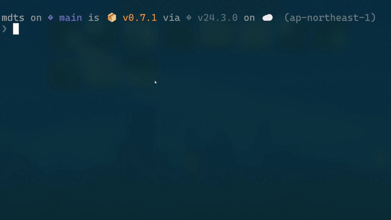

<h1 align="center">
  
</h1>

<p align="center">
  <strong>M</strong>ark<strong>d</strong>own <strong>T</strong>ree <strong>S</strong>erver
  <br>
  A zero-config CLI tool to preview your local Markdown files in a browser.
  <br>
  <strong>npx mdts</strong> — and you're done.
</p>

<p align="center">
  <a href="https://mdts-unhappychoice.netlify.app" target="_blank">
    <strong>🔗 Try the Live Demo</strong>
  </a>
</p>

<p align="center">
  
</p>

## 🔧 Features

- ⚡ **Instant Markdown Preview** – Run and view in seconds  
- 🌐 **Web UI** – Clean, tree-based browser interface with three-panel layout
- 🔄 **Live Reload** – Automatically refreshes on file changes  
- 🧘 **Zero Setup** – No config, no install, no nonsense
- 🎨 **Custom Themes** – 20+ beautiful application themes and syntax highlighting options


## 🚀 Quick Start

```bash
npx mdts
```

This starts a local server at http://localhost:8521 and opens your browser.
Your current directory becomes a browsable Markdown tree.

## 💡 Use Cases

- Reviewing AI-generated docs  
- Quickly checking README or note folders  
- Lightweight local Markdown wiki  

See [detailed use cases](docs/usecases.md) for more examples and workflows.  

## 📦 Requirements

- Node.js
- No installation needed – uses `npx`

## 🛠 Options

```bash
npx mdts [directory] [options]
```

| Option              | Description                                          | Example                        |
| ------------------- | ---------------------------------------------------- | ------------------------------ |
| `[directory]`       | Directory to serve (default `.`)                     | `./docs`                       |
| `--glob`, `-g`      | Glob patterns to filter markdown files               | `-g 'docs/*.md' 'specs/*.md'` |
| `--host`, `-H`      | Host to listen on (default `localhost`)              | `0.0.0.0`                      |
| `--port`, `-p`      | Port to serve on (default `8521`)                    | `8000`                         |
| `--silent`, `-s`    | Suppress server logs (default `false`)               |                                |
| `--no-open`         | Do not open the browser automatically                |                                |
| `--version`, `-V`   | Output version number                                |                                |
| `--help`, `-h`      | Display help for command                             |                                |

### Examples

```bash
# Serve current directory (all markdown files)
npx mdts

# Serve a specific directory
npx mdts ./docs

# Filter with glob patterns (only matching files are shown)
npx mdts ./project -g 'docs/**/*.md' 'README.md'

# Combine options
npx mdts ./monorepo -g 'packages/*/README.md' --port 3000 --no-open
```

## 📚 Documentation

### 🔗 [Live Demo](https://mdts-unhappychoice.netlify.app)
Experience mdts in action with real examples and interactive features.

### 📖 Documentation
- [Use Cases](docs/usecases.md)
- [Markdown Features](docs/markdown_features.md)  
- [Frontend Features](docs/frontend_features.md)
- [Advanced Configuration](docs/configuration.md)
- [API Reference](docs/api.md)
- [Troubleshooting](docs/troubleshooting.md)
- [Comparison with other tools](docs/comparison.md)
- [FAQ](docs/faq.md)

## Contributing

Found a bug? Have an idea? Want to send a PR?  
See [CONTRIBUTING.md](./CONTRIBUTING.md) for details — we'd love to have your help!
