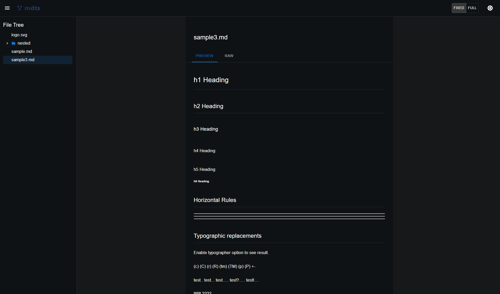

<h1 align="center">
  
</h1>

`mdts` (MarkDown Tree Server) is a simple command-line tool that serves Markdown files from a specified local directory and provides a web-based interface to browse and view them. It automatically opens the served content in your default web browser.

## Features

- **File Tree Navigation**: Provides a hierarchical view of your Markdown files for easy browsing.
- **Markdown Rendering**: Renders Markdown files in a clean, readable format.
- [WIP] **Live Reload**: 




## Usage
```bash
npx mdts
```

By default, `mdts` will serve files from the current directory (`.`) on port `8521`. It will automatically open a new tab in your web browser pointing to `http://localhost:8521`.

### Options

You can specify a different directory and port:

-   `-p, --port <port>`: Specify the port to serve on (default: `8521`)
-   `[directory]`: Specify the directory to serve (default: current directory `.`)

**Example:**

To serve Markdown files from the `docs` directory on port `3000`:

```bash
npx mdts docs -p 3000
```

### Advanced Usage Examples
Here are some practical scenarios where `mdts` can be useful:

-   **Browsing a collection of Markdown notes/documents:**
    If you have a repository where you collect Markdown files exported from various sources (e.g., Notion, Evernote, Confluence), `mdts` can help you browse them easily.
    ```bash
    npx mdts ~/my-markdown-collection
    ```
    This will serve all Markdown files in `~/my-markdown-collection` and its subdirectories, allowing you to navigate through them in your browser.

-   **Exploring a new project's documentation:**
    When joining a new project, you often need to quickly understand its structure and documentation. Running `mdts` at the project root can give you an immediate overview of all Markdown-based documentation (e.g., `README.md`, `CONTRIBUTING.md`, `docs/`).
    ```bash
    # Navigate to your new project's root directory
    cd /path/to/new-project
    npx mdts .
    ```
    This provides a convenient way to browse all project-related Markdown files without opening them individually in a text editor.

-   **Reviewing `README` files of installed `node_modules`:**
    Sometimes you might want to quickly check the `README.md` of a library installed in your `node_modules` directory to understand its usage or features.
    ```bash
    npx mdts node_modules
    ```
    This will serve the `node_modules` directory, allowing you to browse the `README.md` files of your installed packages directly in your browser.

## Development

To build the project:

```bash
npm run build & npm run build:frontend
```

To start the server:
```bash
npm start
```

## License

This project is licensed under the MIT License. See the `LICENSE` file for details.
