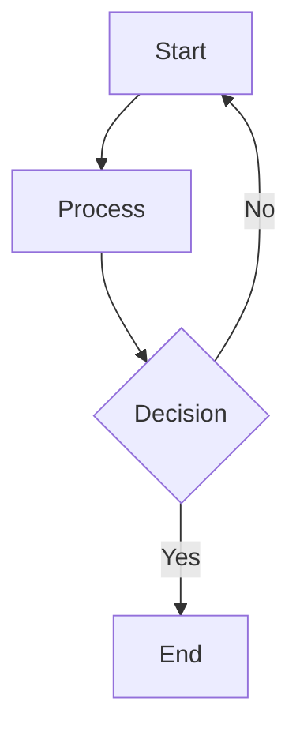

# 📚 Supported Markdown Features

`mdts` provides a rich Markdown reading experience by supporting the full [CommonMark](https://commonmark.org/) specification along with many popular extensions like GitHub Flavored Markdown (GFM) and additional enhancements for modern documentation.

## ✅ CommonMark Features

All standard Markdown syntax is fully supported:

- **Headings**: `# H1` through `###### H6`
- **Paragraphs**: Regular text blocks
- **Emphasis**:  
  - Bold: `**text**` or `__text__`  
  - Italic: `*text*` or `_text_`
- **Blockquotes**: Using `> `
- **Lists**:  
  - Ordered: `1. Item`  
  - Unordered: `- Item` or `* Item`
- **Code**:  
  - Inline: `` `code` ``  
  - Block: <code>```lang</code>
- **Links**: `[label](https://example.com)`
- **Images**: ``
- **Horizontal Rules**: `---`, `***`, or `___`

## 🚀 Extended Features

### 📊 Tables

Render structured data in table format.

```markdown
| Name     | Age | City      |
|----------|:---:|----------:|
| Alice    |  30 | Tokyo     |
| Bob      |  25 | New York  |
```

### ☑️ Task Lists

Perfect for checklists and todos.

```markdown
- [x] Write documentation
- [ ] Implement feature
```

### 💡 GitHub Flavored Markdown (GFM)

`mdts` supports most GFM extensions, including:

* **Autolinks**: Bare URLs like `https://example.com` become clickable links
* **Strikethrough**: `~~text~~` renders as ~~text~~
* **Tables & Task Lists**: (as shown above)

We aim to maintain compatibility with widely adopted Markdown standards to ensure smooth reading, sharing, and collaboration across platforms.

### 🎨 Syntax Highlighting
Code blocks get automatic syntax highlighting when a language is specified.

````markdown
```rust
fn main() {
    println!("Hello, mdts!");
}
```
````

### 🔗 Footnotes

Add footnotes for inline references.

```markdown
Here is some text with a footnote[^1].

[^1]: This is the footnote text.
```

### 📄 Frontmatter

Add YAML metadata at the top of your Markdown files.

```yaml
---
title: "Sample Doc"
author: "Jane Doe"
tags: ["mdts", "docs"]
---
```

### 🧱 Inline HTML

Directly embed raw HTML when needed.

```markdown
This is <strong>bold</strong> using HTML.
```

### 🧠 Mermaid Diagrams

Visualize workflows and diagrams using Mermaid.js.

````markdown

````

### 🧮 Math Formulas (KaTeX)

Embed LaTeX-style math formulas.

````markdown
```math
L = \frac{1}{2} \rho v^2 S C_L
```
````

### 📢 GitHub-Style Alerts

Create admonitions like notes, tips, and warnings.

```markdown
> [!NOTE]
> This is a note.

> [!WARNING]
> This is a warning.
```
