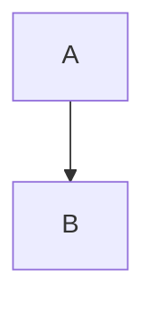

This guide covers common issues you might encounter when using mdts and their solutions.

## Installation & Startup Issues

### ❌ "npx: command not found"
**Problem:** npx is not available on your system.

**Solution:**
- Install Node.js from [nodejs.org](https://nodejs.org/)
- Verify installation: `node --version` and `npm --version`

### ❌ "Port 8521 already in use"
**Problem:** Another service is using the default port.

**Solution:**
```bash
# Use a different port
npx mdts --port 3000

# Or find and stop the conflicting service
lsof -i :8521
```

### ❌ Browser doesn't open automatically
**Problem:** Browser fails to launch automatically.

**Solution:**
- Manually open: http://localhost:8521
- Check if you're running in a headless environment (server, Docker, WSL)

## File Display Issues

### ❌ Markdown files not rendering
**Problem:** Files appear as plain text instead of rendered markdown.

**Solution:**
- Ensure files have `.md` extension
- Check file encoding (should be UTF-8)
- Verify file permissions are readable

### ❌ Images not displaying
**Problem:** Image links are broken in markdown files.

**Solution:**
- Use relative paths from the markdown file location
- Ensure image files exist and are in the mounted directory
- Check file case sensitivity on Linux/macOS

### ❌ Mermaid diagrams not rendering
**Problem:** Mermaid code blocks show as plain text.

**Solution:**
- Use proper fenced code block syntax:
````

````
- Check mermaid syntax is valid
- Refresh the page if diagrams appear broken

## Settings & Configuration Issues

### ❌ Settings not persisting
**Problem:** Theme or font changes reset after browser restart.

**Solution:**
- Check if localStorage is enabled in your browser
- Verify browser isn't in private/incognito mode
- Clear browser cache and try again

### ❌ Config file not saving
**Problem:** System configuration changes don't persist.

**Solution:**
- Check write permissions for `~/.config/mdts/` directory
- Manually create directory: `mkdir -p ~/.config/mdts`
- Verify disk space is available

### ❌ Custom fonts not applying
**Problem:** Selected fonts don't display correctly.

**Solution:**
- Ensure font is installed on your system
- Use font names that exactly match system font names
- Fallback to web-safe fonts if custom fonts fail

## Performance Issues

### ❌ Slow file loading
**Problem:** Large directories take long to load.

**Solution:**
- Point mdts to specific subdirectories instead of root
- Exclude large binary files from the directory
- Use `.gitignore` patterns to limit scanned files

### ❌ High memory usage
**Problem:** mdts consumes excessive memory.

**Solution:**
- Limit the scope of mounted directories
- Restart mdts periodically for long-running sessions
- Check for large markdown files or embedded content

## Network & Access Issues

### ❌ Cannot access from other devices
**Problem:** Server only accessible from localhost.

**Solution:**
```bash
# Listen on all interfaces (security risk on public networks)
npx mdts --host 0.0.0.0

# Or specify your machine's IP
npx mdts --host 192.168.1.100
```

**⚠️ Security Warning:** Only use `--host 0.0.0.0` on trusted networks.

### ❌ WebSocket connection failures
**Problem:** Live reload stops working.

**Solution:**
- Refresh the browser page
- Check console for WebSocket errors
- Restart the mdts server
- Verify no proxy/firewall is blocking WebSocket connections

## File System Issues

### ❌ "Permission denied" errors
**Problem:** Cannot read files or directories.

**Solution:**
```bash
# Check file permissions
ls -la

# Fix permissions if needed (be careful with this)
chmod 644 *.md
chmod 755 directories
```

### ❌ Symlinks not working
**Problem:** Symbolic links don't resolve properly.

**Solution:**
- mdts follows symlinks by default
- Ensure target files exist and are readable
- Check for circular symlink references

## Browser-Specific Issues

### ❌ Safari rendering issues
**Problem:** Some features don't work in Safari.

**Solution:**
- Update to latest Safari version
- Try Chrome or Firefox as alternative
- Check Safari's developer tools for JavaScript errors

### ❌ Internet Explorer compatibility
**Problem:** mdts doesn't work in older browsers.

**Solution:**
- mdts requires modern browser features
- Use Chrome, Firefox, Safari, or Edge (Chromium-based)
- Update to the latest browser version

## Getting Help

If you're still experiencing issues:

1. **Check the FAQ**: [docs/faq.md](faq.md)
2. **Search existing issues**: [GitHub Issues](https://github.com/unhappychoice/mdts/issues)
3. **Create a new issue**: Include:
   - Operating system and version
   - Node.js version (`node --version`)
   - mdts version (`npx mdts --version`)
   - Steps to reproduce
   - Error messages or logs
   - Expected vs actual behavior

---

Most issues are resolved by updating Node.js, checking file permissions, or restarting the server. If you encounter a persistent problem, please report it on GitHub!
