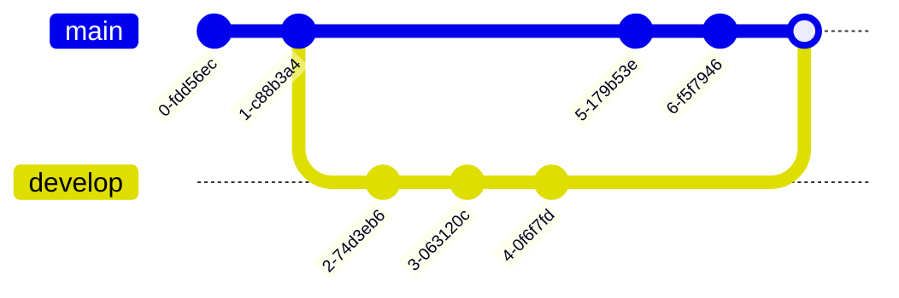

This document demonstrates various types of diagrams that can be created using Mermaid syntax within Markdown.

## 1. Flowchart

## 2. Sequence Diagram

## 3. Class Diagram

## 4. State Diagram

## 5. Gantt Chart

## 6. Pie Chart

## 7. Git Graph

## 8. User Journey

