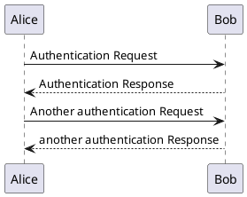
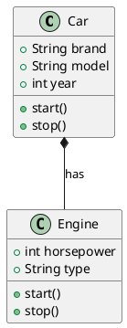
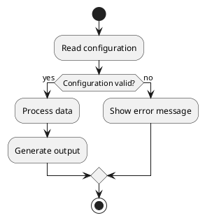
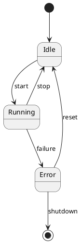
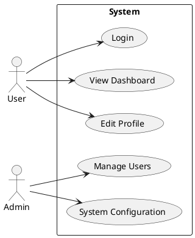
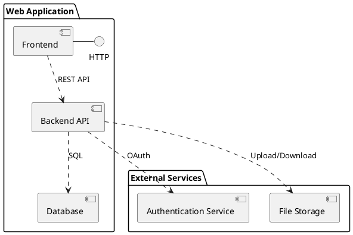
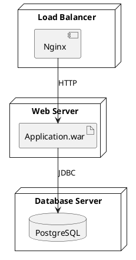

# PlantUML Diagrams

PlantUML is a component that allows you to quickly write various UML diagrams using simple textual descriptions.

## Sequence Diagram

## Class Diagram

## Activity Diagram

## State Diagram

## Use Case Diagram

## Component Diagram

## Deployment Diagram

